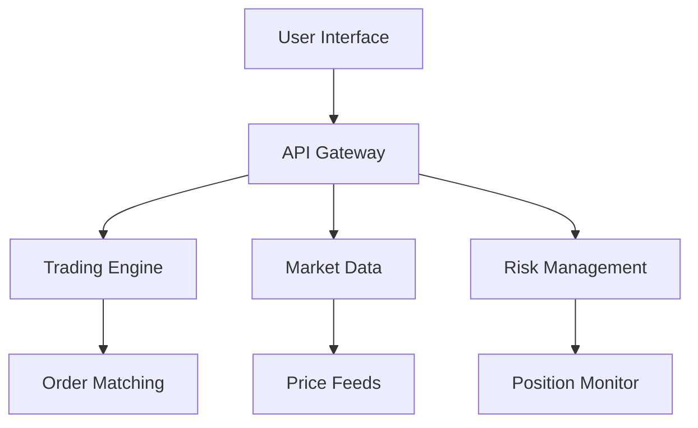

# Platform Overview

HYPIQ provides a comprehensive suite of trading tools and features designed for professional cryptocurrency trading.

## Core Features

### Advanced Trading Interface

Our platform offers a sophisticated trading interface with:

- **Real-time Market Data**: Live price feeds and market depth
- **Advanced Charting**: Professional-grade charts with technical indicators
- **Order Management**: Multiple order types and execution strategies
- **Portfolio Tracking**: Real-time portfolio monitoring and analytics

### Market Analysis Tools

<CardGroup cols={2}>
  <Card title="Technical Analysis" icon="chart-line">
    Advanced charting tools with 50+ technical indicators
  </Card>
  <Card title="Market Insights" icon="lightbulb">
    AI-powered market analysis and trend identification
  </Card>
  <Card title="Risk Assessment" icon="shield-check">
    Real-time risk metrics and portfolio analysis
  </Card>
  <Card title="Performance Analytics" icon="chart-bar">
    Detailed performance tracking and reporting
  </Card>
</CardGroup>

## Trading Features

### Order Types

HYPIQ supports various order types to meet your trading needs:

- **Market Orders**: Execute immediately at current market price
- **Limit Orders**: Execute at specified price or better
- **Stop Orders**: Trigger orders based on price movements
- **Advanced Orders**: OCO, trailing stops, and more

### Risk Management

<Accordion title="Position Sizing">
  Automated position sizing based on risk parameters and account balance
</Accordion>

<Accordion title="Stop Loss">
  Automatic stop loss orders to limit potential losses
</Accordion>

<Accordion title="Take Profit">
  Automatic profit-taking at predetermined levels
</Accordion>

## Platform Architecture

The HYPIQ platform is built on modern, scalable architecture:

## Security Features

<Warning>
  Security is our top priority. All user funds and data are protected with industry-leading security measures.
</Warning>

- **Multi-signature Wallets**: Enhanced security for fund storage
- **Two-Factor Authentication**: Additional account protection
- **Encrypted Communications**: All data transmission is encrypted
- **Regular Security Audits**: Continuous security monitoring and updates

## Getting Support

Need help with the platform? We're here to assist:

<CardGroup cols={2}>
  <Card title="Documentation" icon="book" href="/faq">
    Browse our comprehensive FAQ section
  </Card>
  <Card title="Contact Support" icon="envelope" href="mailto:support@hypiq.finance">
    Reach out to our support team directly
  </Card>
</CardGroup>